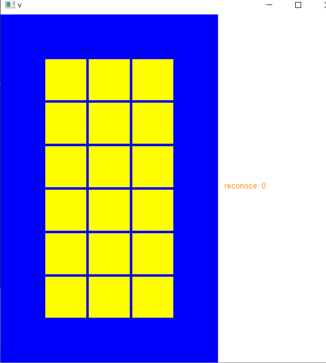
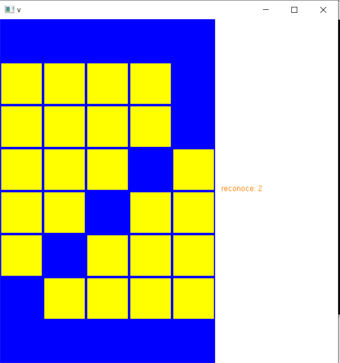
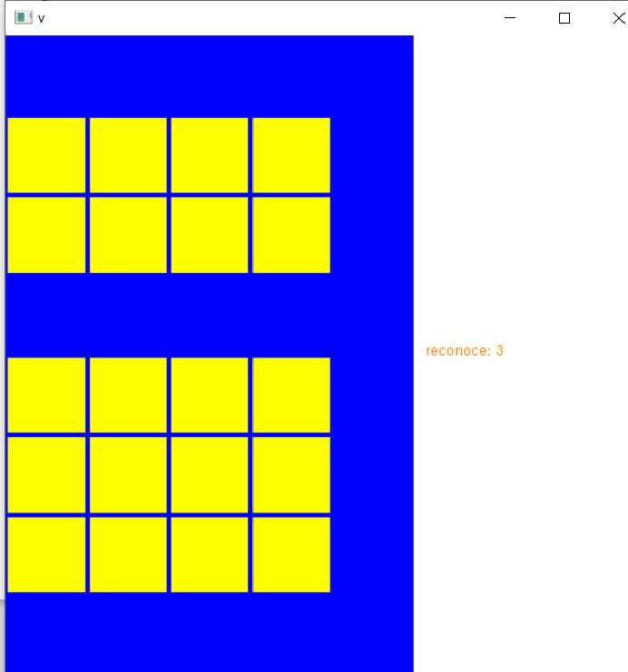
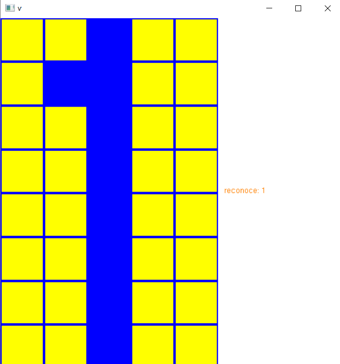

# InteligenciaaArtificial-Laboraatorio4-Peerceptron
implementacion de peerceptron IA2021 Laboraatorio 4
Se implemento el perceptron con todo lo pedido en clase entonces primeramente veamos las especificaciones:
Integrante : Alvaro Diego Durand 
1.El codigo fue realizado en c++ usando la libreria OpenGL para tratar todo el tema de animacion

2.El menu del codigo te pedira el numero de columnas y filas en el cual tendras que ingresar por
teclado el tamaño que desees.

3.Luego de eso en pantalla mostrara una matriz de n x m y al hacerle click a cda cuadrado esta se guardara
y podras hacer tu imagen que en este caso son numeros de el 0 al 3 y el programa tendra que reconocer cuando
se haga un numero.

4.Aca se pueden apreciar algunos ejemplos

